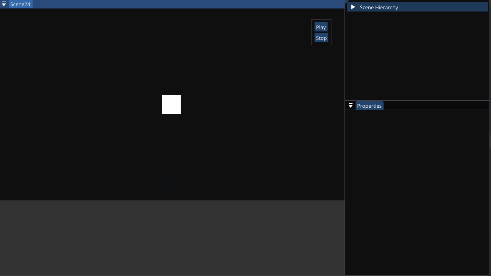

# Gargantua
A 2d game engine under development.  

  

# Installation
Prerequisites: latest version of premake5 https://premake.github.io/ and VisualStudio with support for C++23.  
Run: git clone --recurse-submodules https://github.com/Giully314/Gargantua.git   
In the Gargantua directory run: premake5 vs2022.  
Open visual studio and run.  

# Project structure and directories
## Gargantua
app:		Application API for the engine.  
core:		Core components of the engine.    
ds:			Implementation of data structures.  
ecs:		Implementation of the entity component system.  
generator:	Generators using coroutines.  
log:		Basic logging system.  
math:		Vector and Matrices definitions (2d, 3d, 4d). Various math utility functions.  
mpl:		Meta programming library.  
parallel:	Thread pool and parallel algorithms.  
physics:	Primitive physics system with collision resolution.  
platform:	Manage low level systems like I/O and event dispatcher.  
render:		Low level components for handling render objects.   
resource:	Utility.  
scene:		Scene components.  
time:		Manage time in the engine.  

## GargantuaEditor
editor: stages for the Editor application

## Sandbox 
Used for tests.

# TODO
https://trello.com/b/c2i4BD7O/gargantua  

# Language 
The project is based on C++20/23.

# Personal considerations
This is my first game engine. I'm developing this engine because I find really 
interesting how simulations are created. I also want start to develop a game based on pixel simulation.  
I minimized the usage of external libraries because I enjoy to design and develop the core functionalities.
At first I also wanted to avoid the usage of glfw (and even of opengl, after I followed the beautiful project tinyrenderer)
but then I realized that the focus of the project would shift too much. 
In the end, I hope to learn as much as possible and become better at design and develop software!  

# Architecture 
You will notice a lot of singleton. 
Almost all the systems of the engine are singleton because we need only one instance and 
this instance must be accessible from every point. I really don't like this approach because it 
could be not safe (specially when multithreading will be implemented) but it is the most simple and 
straightforward approach that came to my mind. Another approach is to have a System class that manages 
all the systems and provides the access point. 

# Resource that i found useful

## Other engines 
TheCerno game engine series.  
Godot engine source code.  
Ogre engine source code.  

## Books
Large scale C++ volume 1 by John Lakos.  
Game engine architecture by Jason Gregory.  
Game Physics by David H. Eberly.  
Real-time collision detection by Christer Ericson.  
Mathematics for 3D Game Programming and Computer Graphics.  

## Conferences and articles
Input:  
https://sites.psu.edu/ist446/2015/04/16/so-you-want-to-make-a-game-engine-part-6-input-need-input/

About engines:  
https://www.gamedeveloper.com/programming/writing-a-game-engine-from-scratch---part-1-messaging  
https://ourmachinery.com/post/   

Memory management: https://gist.github.com/simonrenger/d1da2a10d11f8a971fc6f1b574ab3e99  

Talk about task oriented multi threading: 
https://www.gdcvault.com/play/1022186/Parallelizing-the-Naughty-Dog-Engine  
https://www.gdcvault.com/play/1012189/Don-t-Dread  
https://vkguide.dev/docs/extra-chapter/multithreading/ (useful additional resources)  
GCAP 2016: Parallel Game Engine Design - Brooke Hodgman: https://www.youtube.com/watch?v=JpmK0zu4Mts   
CppCon 2016: Jason Jurecka “Game engine using STD C++ 11": https://youtu.be/8AjRD6mU96s   

ECS:  
https://skypjack.github.io/2019-02-14-ecs-baf-part-1/  

Physics:  
https://gafferongames.com/categories/game-physics/  
https://gamedevelopment.tutsplus.com/series/how-to-create-a-custom-physics-engine--gamedev-12715  
[Building a Physics Engine with C++ and Simulating Machines](https://youtu.be/TtgS-b191V0)  
[Runge-Kutta method for solving differential equations](https://en.wikipedia.org/wiki/Runge%E2%80%93Kutta_methods)  
[Semi implicit Euler, used in the engine](https://en.wikipedia.org/wiki/Semi-implicit_Euler_method)  
[Various links](https://sketchpunklabs.github.io/gamephysics/)   

STD containers, custom containers and iterators:  
https://www.internalpointers.com/post/writing-custom-iterators-modern-cpp   
Mathieu Ropert “This Videogame Programmer Used the STL and You Will Never Guess What Happened Next”: https://youtu.be/6hC9IxqdDDw   

Graphics:
How 3D video games do graphics: https://www.youtube.com/watch?v=bGe-d09Nc_M  
https://github.com/ssloy/tinyrenderer   
https://www.scratchapixel.com/
